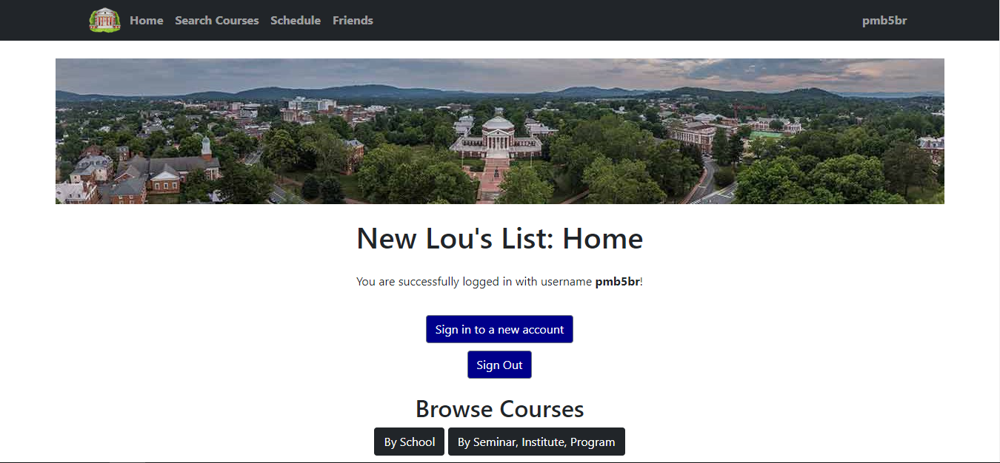

# CS 3240: Advanced Software Development Techniques 

#### Hi there. This is Group A-23 :wave: 

### Project: New Lou's List

### Project Concept :thought_balloon:
 
This project aims to create a student friendly class management system by eliminating problems like slow content filtering, and by providing a better web-based system that will allow students to quickly view and search classes. The project focuses and consists of the following basic features:
 
:mag: Students will be able to view and search classes, separated into logical categories.

:spiral_calendar: Students will be able to save a prospective schedule for a given semester. 

:speech_balloon: Students will be able to “friend” other students to see their schedule and leave a comment on their schedule.

### Main Features and Website Walkthrough :dart:

|  | 
|:--:| 
| *This is the website’s landing page that allows the user to search and browse classes without logging in to the website. However, the user won’t be able to use features like creating schedules and adding friends if not logged in.* |

|  | 
|:--:| 
| *Once logged in, all the features will appear in the navigation bar, making it easier for the users to navigate and access all the available features. Besides, there are buttons on the bottom of this page that allows users to browse courses and view them in separated logical categories.* |

|  | 
|:--:| 
| *The Search Courses page allows users to search classes. Subject’s mnemonic, Catalog Number and Days Held are some of the inputs that users can play with to browse different classes available at the University of Virginia.* |

|  | 
|:--:| 
| *This is how the list of classes related to the user’s search looks like. It shows sections, units, enrollments, instructor name, meeting time, and location of each class. Besides, it also has an “Add to Schedule” button allowing users to add classes to their schedule.* |

|  | 
|:--:| 
| *Next is the Schedule page, where users can save and see their personal schedule for a given semester. User has an option to remove the class from the schedule.* |

|  | 
|:--:| 
| *Along with that the user can add comments for their schedules and look at the comments on their schedule from their friends.* |

|  | 
|:--:| 
| *Friends page is the page where the users can add friends to look at their schedules and leave comments. The basic information, such as username, year, major, minor, and bio, of the added friends can be seen on this page. In addition to this, the users can filter and view the list of their added friends as per their need.* |

|  | 
|:--:| 
| *When the user clicks on the friend's name, he will be able to see the schedule of that friend, and will be able to leave comments for that friend and the schedule.* |

|  | 
|:--:| 
| *The username on the top right corner on the website will lead users to the profile page where they can update their personal information like year, major, minor and bio. They can also sign out from the website here.* |

### Website Page Structure :desktop_computer:

Here, the navigation bar panel is highlighted in gray because this navigation is possible from every page listed on the chart. When a user is not logged in, only home.html, searchPage.html, and classList.html are accessible. The arrows also do not denote the typical symbolism in a decomposition chart; they denote where web page redirects or method page refreshes happen.

### Database Structure :floppy_disk:

Here, ‘User’ is a class provided by and stored by the Django web framework. The arrows do not use traditional decomposition meaning. They refer to the portions of the variables under the models that refer to other data (e.g. the arrow going from ‘UserProfile’ with the head on ‘User’ indicates that an instance of ‘user’ in ‘UserProfile’ is an instance of a specific ‘User.’ )

### Team Members :computer:
- Amelia Norman
- Victoria Murdock
- Liam O'Donnell
- Decker Bristow
- Harshil Patel
